# Say-Do Gap Intelligence System
## Conceptual Framework & Methodology

---

## Executive Summary

The Say-Do Gap Intelligence System detects and analyzes discrepancies between customer stated intentions (surveys, feedback, interviews) and actual behavioral data (transactions, usage patterns, engagement metrics), transforming these insights into predictive intelligence and actionable recommendations.

---

## 1. Core Concept: The Say-Do Gap

### 1.1 Definition
The **Say-Do Gap** represents the delta between:
- **STATED**: What customers say they want, need, value, or will do
- **ACTUAL**: What customers actually purchase, use, engage with, or do

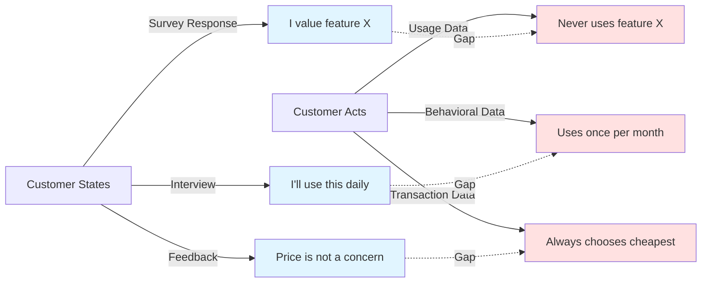

### 1.2 Why This Gap Matters

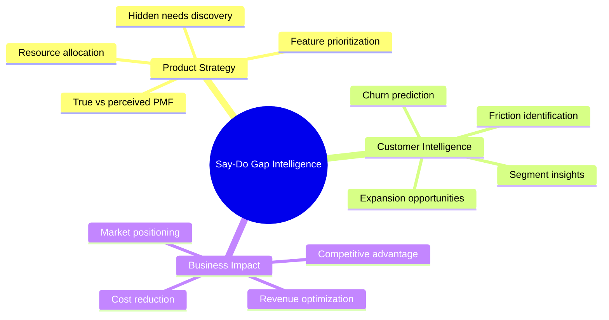

### 1.3 Types of Say-Do Gaps

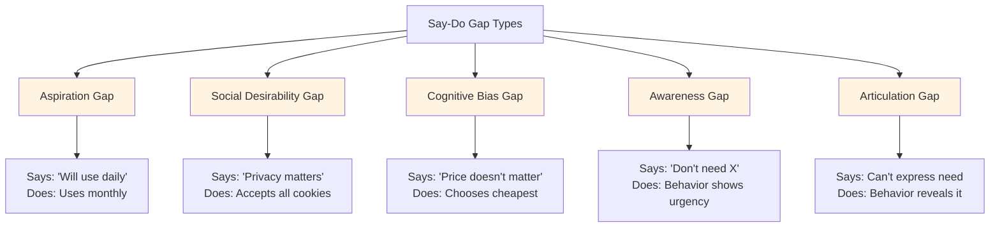

---

## 2. Methodological Framework

### 2.1 Data Collection Strategy

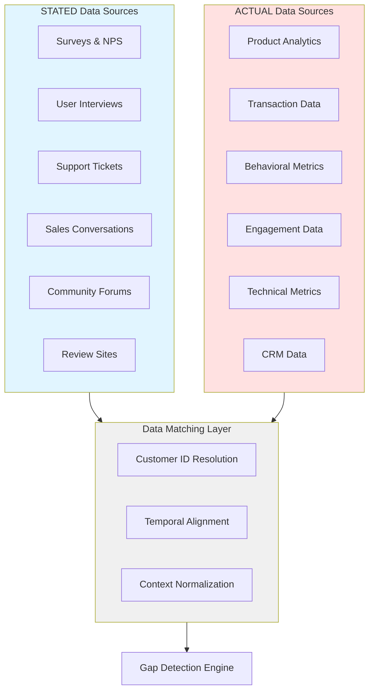

### 2.2 Gap Detection Methodology

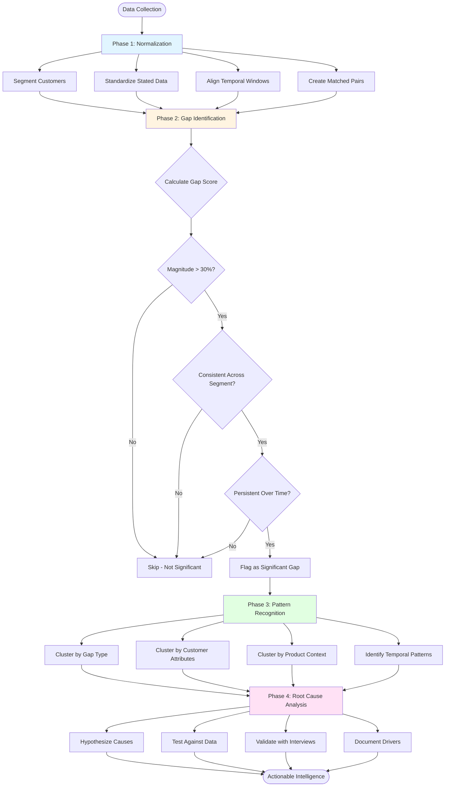

### 2.3 Intelligence Generation Framework

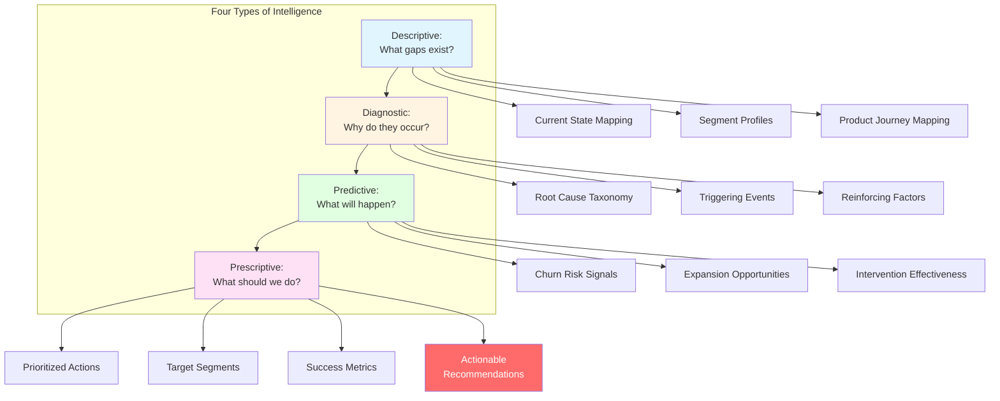

---

## 3. Analytical Models

### 3.1 Gap Scoring Architecture

```mermaid
flowchart LR
    subgraph Input["Input Data"]
        I1[Stated Value]
        I2[Actual Value]
        I3[Sample Size]
        I4[Data Quality]
        I5[Recency]
    end
    
    subgraph Calculate["Calculation"]
        C1[Raw Gap =<br/>Stated - Actual / Stated]
        C2[Confidence Weight =<br/>f Sample, Quality, Recency]
        C3[Individual Gap Score =<br/>Raw Gap × Confidence]
    end
    
    subgraph Aggregate["Aggregation"]
        A1[Business Impact Score]
        A2[Addressability Score]
        A3[Aggregate Gap Index =<br/>Σ IGS × Impact × Address]
    end
    
    Input --> Calculate
    Calculate --> Aggregate
    Aggregate --> Output[Prioritized<br/>Gap List]
    
    style Input fill:#e1f5ff
    style Calculate fill:#fff4e1
    style Aggregate fill:#e1ffe1
    style Output fill:#ff6b6b,color:#fff
```

### 3.2 Predictive Model Ecosystem

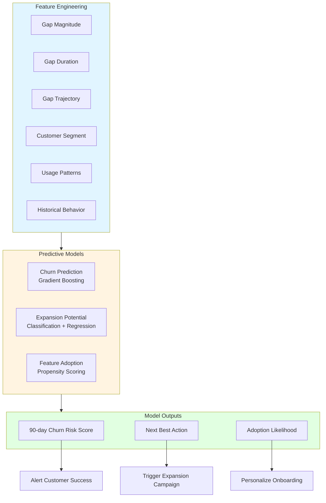

### 3.3 Recommendation Engine Logic

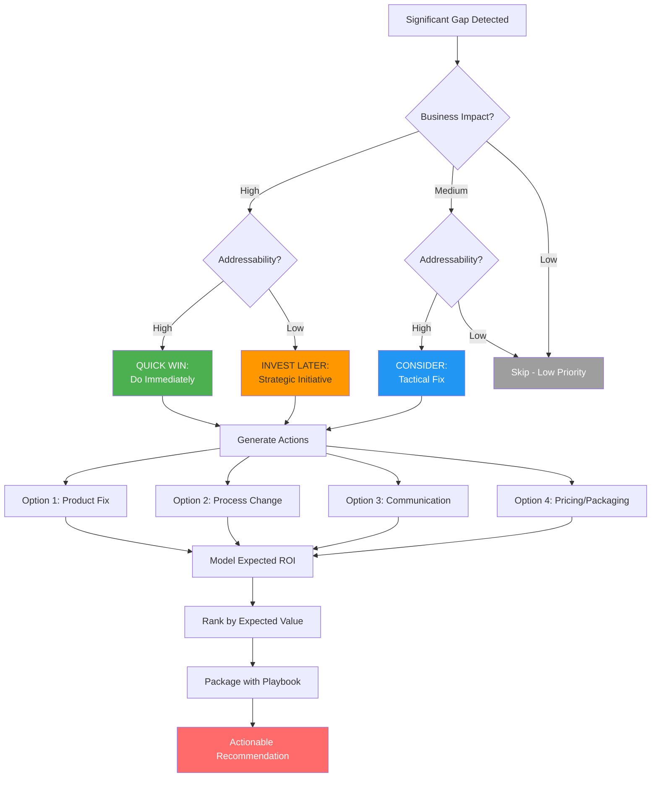

---

## 4. Operational Framework

### 4.1 Continuous Intelligence Loop

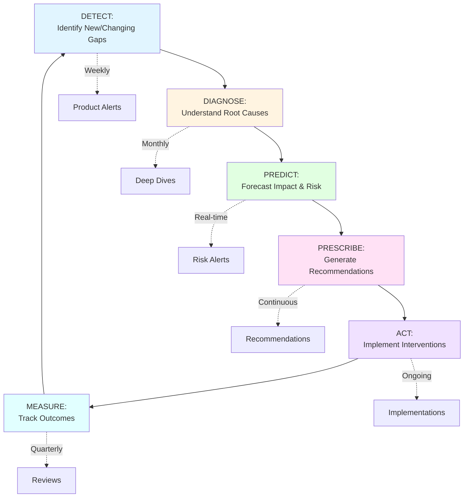

### 4.2 Stakeholder Engagement Model

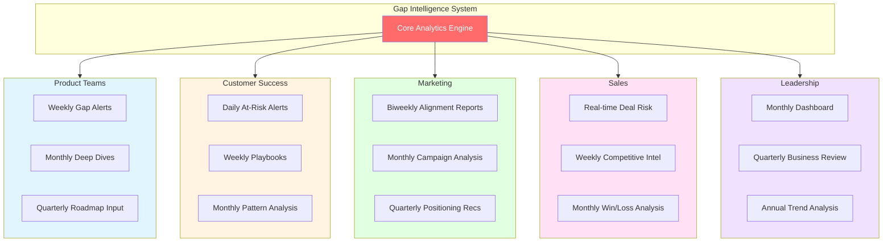

### 4.3 Success Metrics Framework

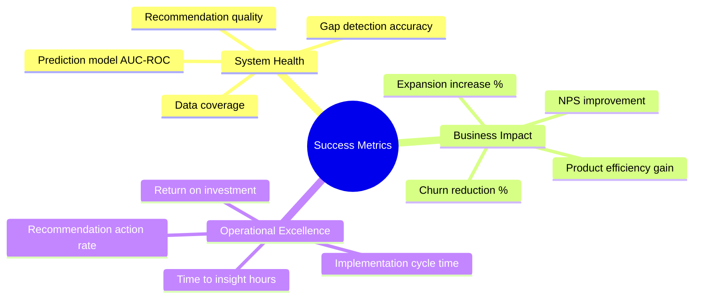

---

## 5. Implementation Phases

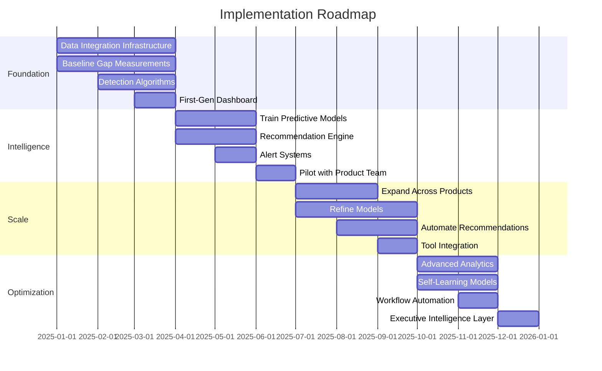

---

## 6. Critical Success Factors

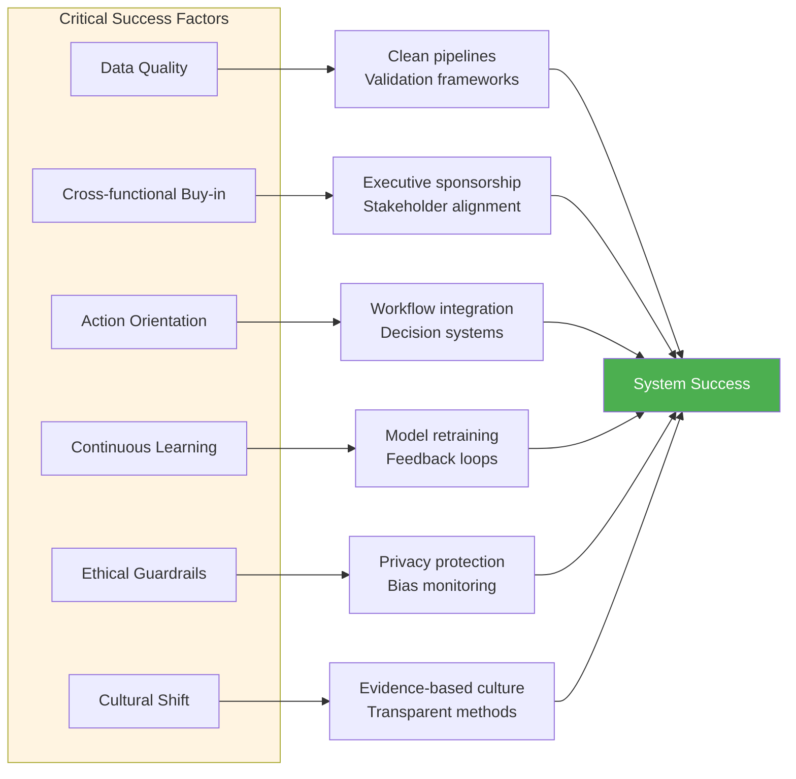

---

## 7. Example Gap Scenarios

### Scenario 1: The "Power User" Paradox

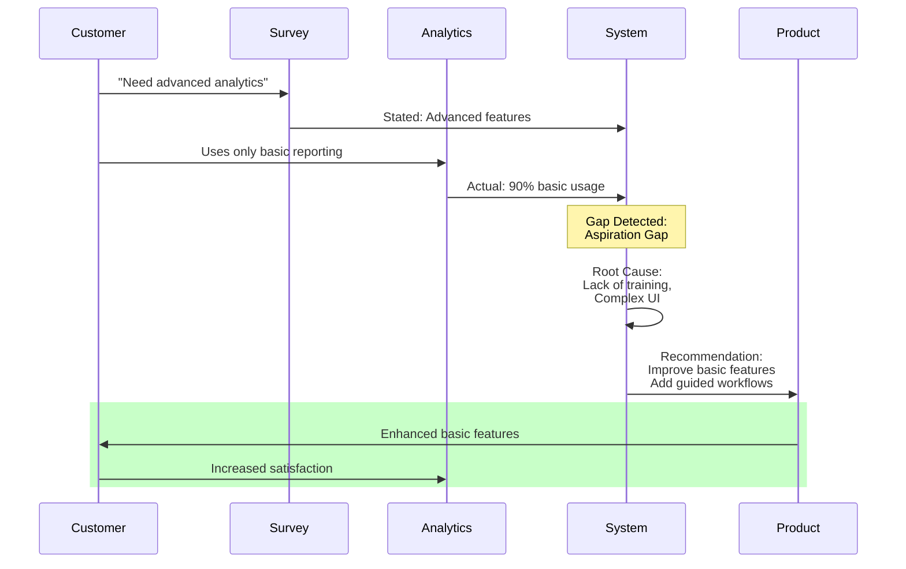

### Scenario 2: Price Sensitivity Illusion

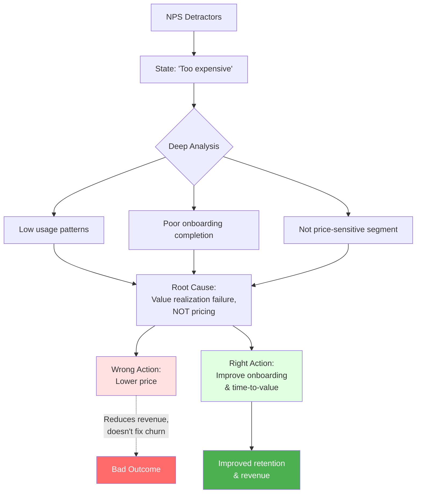

### Scenario 3: Hidden Champions

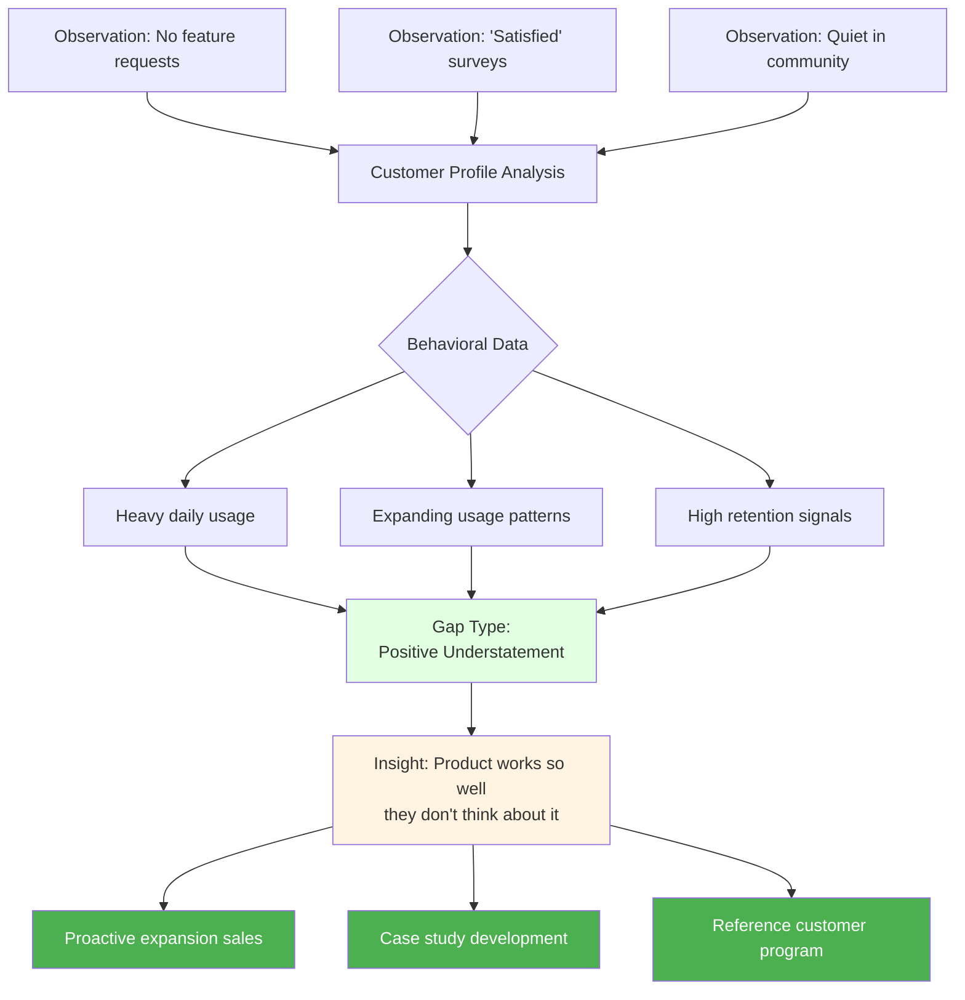

---

## Appendix: Measurement Taxonomies

### Data Category Mapping

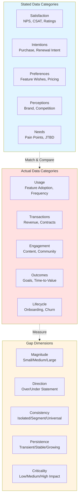
