# Say-Do Gap Intelligence System
## Technical Architecture & Implementation Guide

---

## 1. System Overview

### 1.1 High-Level Architecture

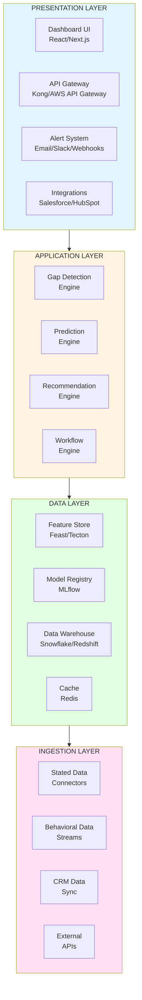

### 1.2 Data Flow Architecture

```mermaid
flowchart LR
    subgraph Sources["Data Sources"]
        S1[(Survey DB)]
        S2[(Product Analytics)]
        S3[(CRM)]
        S4[(Support Tickets)]
        S5[(Transaction DB)]
    end
    
    subgraph Ingestion["Ingestion & ETL"]
        I1[Fivetran/Airbyte]
        I2[Kafka Streams]
        I3[Custom Connectors]
    end
    
    subgraph Storage["Storage"]
        Raw[(S3 Raw Data Lake)]
        Processed[(S3 Processed)]
        DW[(Data Warehouse)]
    end
    
    subgraph Processing["Processing"]
        DBT[dbt Transformations]
        Python[Python/PySpark]
        AF[Airflow Orchestration]
    end
    
    subgraph ML["ML Pipeline"]
        FE[Feature Engineering]
        Train[Model Training]
        Deploy[Model Deployment]
    end
    
    subgraph Serve["Serving Layer"]
        FS[Feature Store]
        MR[Model Registry]
        API[Prediction API]
    end
    
    Sources --> Ingestion
    Ingestion --> Storage
    Storage --> Processing
    Processing --> Storage
    Storage --> ML
    ML --> Serve
    Serve --> App[Application Layer]
    
    style Sources fill:#e1f5ff
    style Storage fill:#fff4e1
    style ML fill:#e1ffe1
    style Serve fill:#ffe1f5
```

---

## 2. Technology Stack

### 2.1 Technology Choices

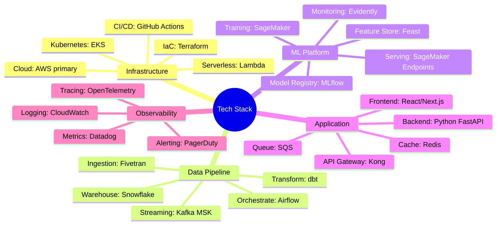

### 2.2 Infrastructure Architecture

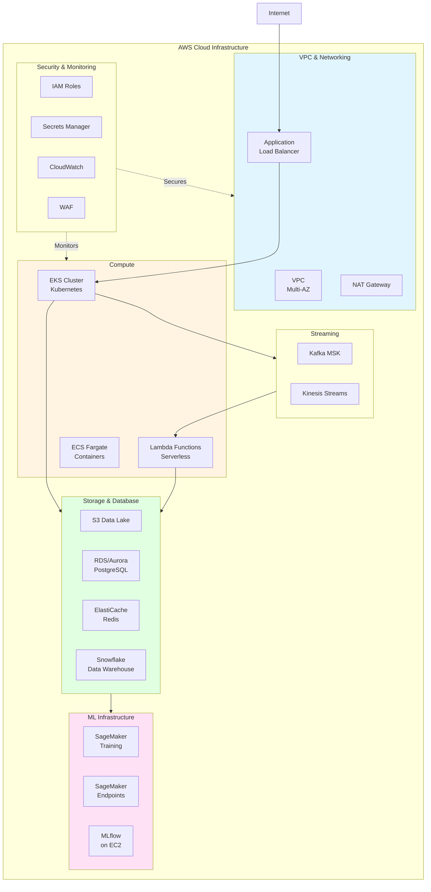

---

## 3. Core Components

### 3.1 Gap Detection Engine

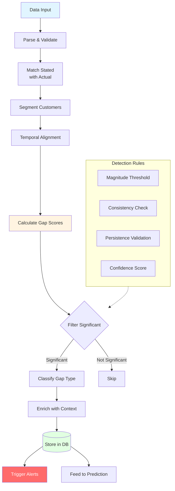

**Technology Implementation:**
```python
# Gap Detection Service (FastAPI)
class GapDetectionEngine:
    - detect_gaps(customer_segment, time_window)
    - calculate_gap_score(stated, actual)
    - classify_gap_type(gap_score, context)
    - filter_significant_gaps(gaps, thresholds)
    - enrich_with_metadata(gaps)
    
# Runs on: Kubernetes (EKS)
# Triggered by: Scheduled jobs (Airflow) + Real-time events (Kafka)
# Stores in: PostgreSQL + Snowflake
```

### 3.2 Prediction Engine

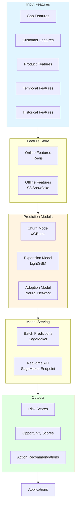

**ML Pipeline Architecture:**

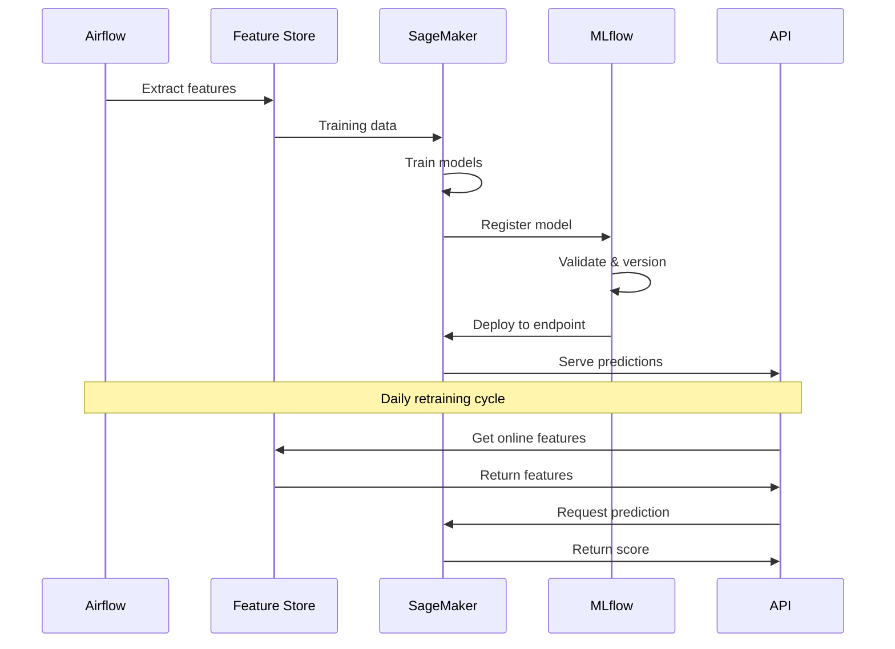

### 3.3 Recommendation Engine

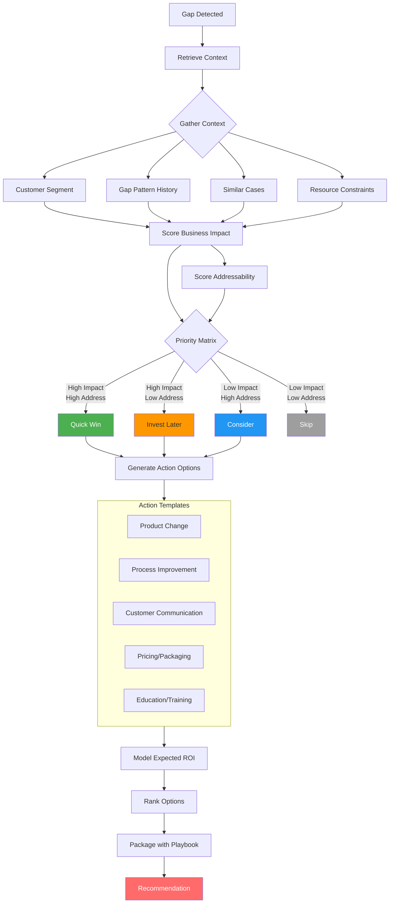

**Recommendation Logic:**
```python
# Recommendation Service
class RecommendationEngine:
    - calculate_impact_score(gap, customer, context)
    - calculate_addressability(gap, resources, timeline)
    - generate_action_options(gap_type, playbook_library)
    - model_expected_roi(action, historical_data)
    - rank_recommendations(options, scores)
    - package_with_playbook(recommendation)
    
# Uses: Rules engine + ML models + Historical data
# Outputs: JSON recommendations with confidence scores
```

### 3.4 Workflow Engine

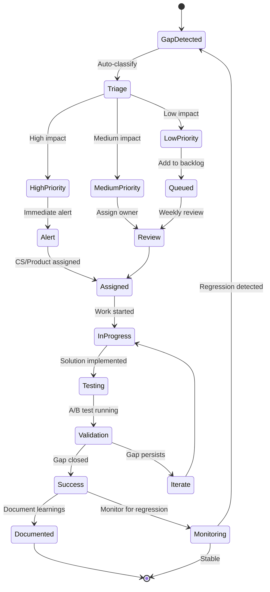

---

## 4. Data Pipeline Implementation

### 4.1 ETL Architecture

```mermaid
graph LR
    subgraph Extract["EXTRACT"]
        E1[Survey APIs<br/>Qualtrics/Typeform]
        E2[Product Events<br/>Segment/Amplitude]
        E3[CRM APIs<br/>Salesforce]
        E4[Support<br/>Zendesk/Intercom]
        E5[Transactions<br/>Stripe/Internal DB]
    end
    
    subgraph Load["LOAD"]
        L1[Fivetran<br/>SaaS Connectors]
        L2[Kafka Connect<br/>Event Streaming]
        L3[Custom Python<br/>SDKs]
    end
    
    subgraph Stage["STAGING"]
        S1[(S3 Raw Zone<br/>JSON/Parquet)]
    end
    
    subgraph Transform["TRANSFORM"]
        T1[dbt Models<br/>SQL]
        T2[PySpark Jobs<br/>Complex Logic]
        T3[Airflow DAGs<br/>Orchestration]
    end
    
    subgraph Serve["SERVE"]
        DW[(Snowflake<br/>Analytics)]
        FS[(Feature Store<br/>ML Features)]
        OLTP[(PostgreSQL<br/>App Data)]
    end
    
    Extract --> Load
    Load --> Stage
    Stage --> Transform
    Transform --> Serve
    
    style Extract fill:#e1f5ff
    style Load fill:#fff4e1
    style Transform fill:#e1ffe1
    style Serve fill:#ffe1f5
```

### 4.2 Data Models

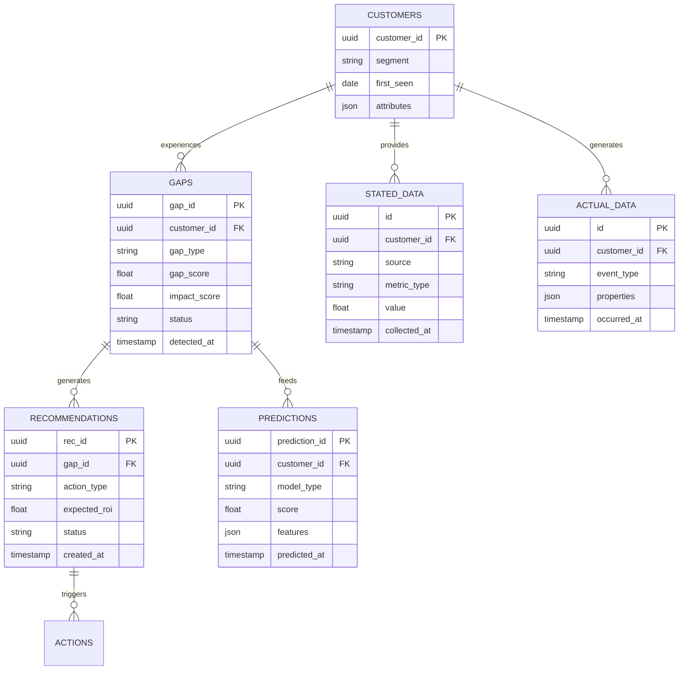

### 4.3 dbt Transformation Flow

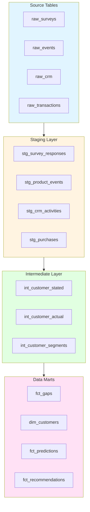

---

## 5. ML Operations (MLOps)

### 5.1 Model Training Pipeline

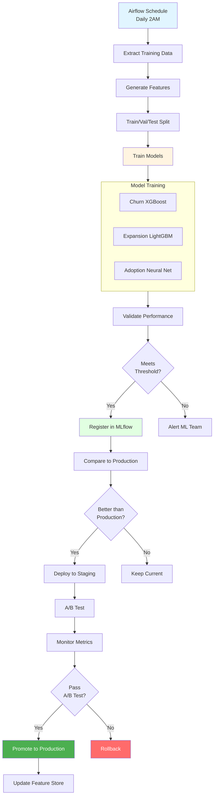

### 5.2 Model Monitoring

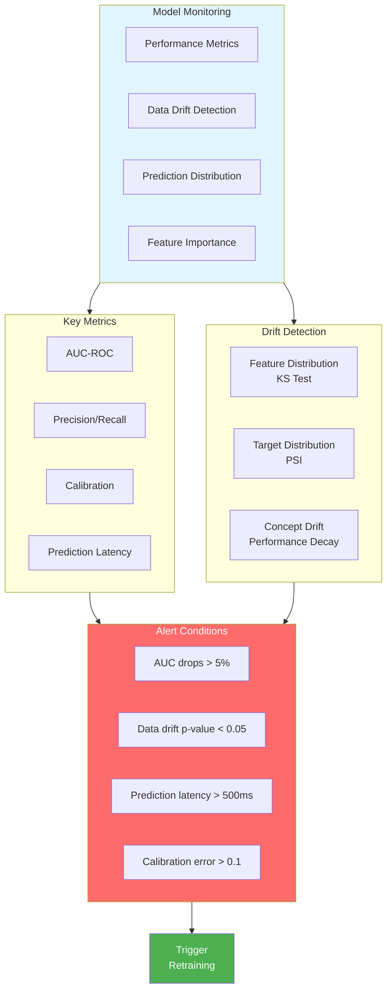

### 5.3 Feature Store Architecture

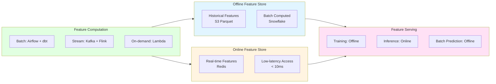

---

## 6. API Architecture

### 6.1 API Endpoints

```mermaid
graph TB
    subgraph Gateway["API Gateway - Kong"]
        Auth[Authentication<br/>JWT]
        RL[Rate Limiting]
        Log[Logging]
    end
    
    subgraph Endpoints["API Endpoints"]
        E1[/api/v1/gaps]
        E2[/api/v1/predictions]
        E3[/api/v1/recommendations]
        E4[/api/v1/customers]
        E5[/api/v1/actions]
    end
    
    subgraph Services["Backend Services"]
        S1[Gap Service]
        S2[Prediction Service]
        S3[Recommendation Service]
        S4[Customer Service]
        S5[Action Service]
    end
    
    Gateway --> Endpoints
    E1 --> S1
    E2 --> S2
    E3 --> S3
    E4 --> S4
    E5 --> S5
    
    S1 & S2 & S3 & S4 & S5 --> DB[(PostgreSQL)]
    S1 & S2 & S3 --> Cache[(Redis)]
    
    style Gateway fill:#e1f5ff
    style Endpoints fill:#fff4e1
    style Services fill:#e1ffe1
```

### 6.2 API Request Flow

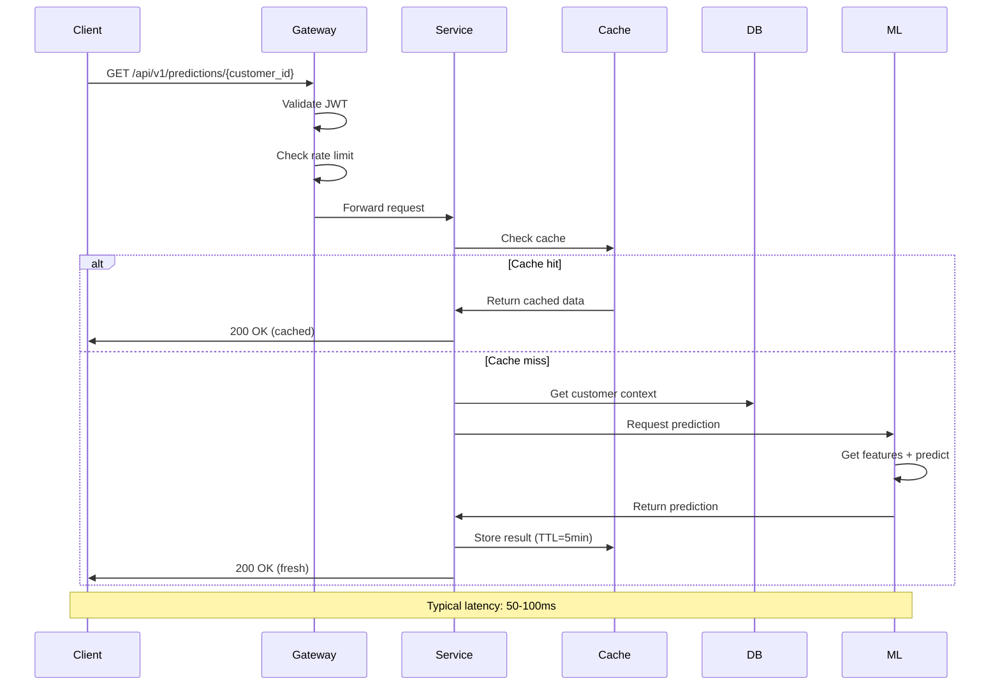

---

## 7. Dashboard & UI

### 7.1 Dashboard Architecture

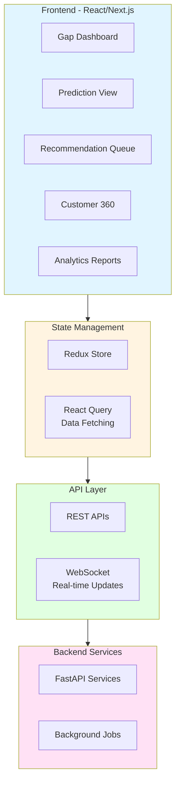

### 7.2 Dashboard Views

```mermaid
graph TD
    Dashboard[Main Dashboard] --> Overview[Overview KPIs]
    Dashboard --> Gaps[Gap Explorer]
    Dashboard --> Predictions[Risk & Opportunity]
    Dashboard --> Recommendations[Action Queue]
    
    Overview --> O1[Total Gaps Detected]
    Overview --> O2[High Priority Count]
    Overview --> O3[Avg Gap Score]
    Overview --> O4[Trend Analysis]
    
    Gaps --> G1[Gap List Table]
    Gaps --> G2[Filters & Segments]
    Gaps --> G3[Gap Detail View]
    Gaps --> G4[Historical Trends]
    
    Predictions --> P1[Churn Risk List]
    Predictions --> P2[Expansion Opportunities]
    Predictions --> P3[Feature Adoption Forecast]
    Predictions --> P4[Model Confidence]
    
    Recommendations --> R1[Action Queue]
    Recommendations --> R2[Priority Matrix]
    Recommendations --> R3[Implementation Playbooks]
    Recommendations --> R4[Impact Tracking]
    
    style Dashboard fill:#e1f5ff
    style Overview fill:#fff4e1
    style Gaps fill:#e1ffe1
    style Predictions fill:#ffe1f5
    style Recommendations fill:#f0e1ff
```

---

## 8. Security & Compliance

### 8.1 Security Architecture

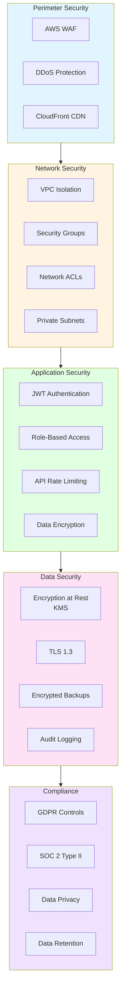

---

## 9. Deployment & Operations

### 9.1 Deployment Pipeline

```mermaid
flowchart LR
    Dev[Developer] -->|Push Code| GH[GitHub]
    GH -->|Trigger| GHA[GitHub Actions]
    
    GHA --> Build[Build & Test]
    Build --> Scan[Security Scan]
    Scan --> Docker[Build Docker Image]
    Docker --> ECR[Push to ECR]
    
    ECR --> ArgoCD[ArgoCD]
    ArgoCD -->|Deploy| Dev[Dev Environment]
    
    Dev --> Promote{Manual Approval}
    Promote -->|Approved| Staging[Staging Environment]
    
    Staging --> E2E[E2E Tests]
    E2E --> Smoke[Smoke Tests]
    Smoke --> Promote2{Manual Approval}
    
    Promote2 -->|Approved| Prod[Production]
    Prod --> Canary[Canary Deployment]
    Canary --> Monitor[Monitor Metrics]
    Monitor --> RolloutDecision{Healthy?}
    
    RolloutDecision -->|Yes| Complete[Complete Rollout]
    RolloutDecision -->|No| Rollback[Auto Rollback]
    
    style Build fill:#e1f5ff
    style Staging fill:#fff4e1
    style Prod fill:#e1ffe1
    style Complete fill:#4caf50,color:#fff
    style Rollback fill:#ff6b6b,color:#fff
```

### 9.2 Monitoring & Alerting

```mermaid
graph TB
    subgraph Sources["Monitoring Sources"]
        App[Application Logs]
        Metrics[System Metrics]
        Traces[Distributed Traces]
        Custom[Custom Events]
    end
    
    subgraph Collection["Collection Layer"]
        OTel[OpenTelemetry]
        CW[CloudWatch Agent]
        DD[Datadog Agent]
    end
    
    subgraph Analysis["Analysis & Storage"]
        Datadog[Datadog]
        CloudWatch[CloudWatch]
        S3[S3 Archives]
    end
    
    subgraph Alerting["Alerting"]
        Thresholds[Threshold Alerts]
        Anomaly[Anomaly Detection]
        SLO[SLO Violations]
    end
    
    subgraph Response["Response"]
        PD[PagerDuty]
        Slack[Slack]
        Email[Email]
        Runbooks[Automated Runbooks]
    end
    
    Sources --> Collection
    Collection --> Analysis
    Analysis --> Alerting
    Alerting --> Response
    
    style Sources fill:#e1f5ff
    style Analysis fill:#fff4e1
    style Alerting fill:#ffe1f5
    style Response fill:#ff6b6b,color:#fff
```

---

## 10. Scalability & Performance

### 10.1 Scaling Strategy

```mermaid
graph TB
    subgraph Horizontal["Horizontal Scaling"]
        K8s[Kubernetes HPA]
        Load[Load Balancing]
        Sharding[Database Sharding]
    end
    
    subgraph Caching["Caching Strategy"]
        Redis[Redis Cache]
        CDN[CDN Caching]
        Query[Query Result Cache]
    end
    
    subgraph Async["Async Processing"]
        Queue[SQS Queues]
        Workers[Worker Pools]
        Batch[Batch Processing]
    end
    
    subgraph Optimization["Performance Optimization"]
        Index[Database Indexes]
        Partition[Table Partitioning]
        Compress[Data Compression]
    end
    
    Horizontal --> Performance[High Performance<br/>Low Latency]
    Caching --> Performance
    Async --> Performance
    Optimization --> Performance
    
    style Performance fill:#4caf50,color:#fff
```

### 10.2 Performance Targets

```mermaid
graph LR
    subgraph API["API Performance"]
        A1[p50: < 100ms]
        A2[p95: < 300ms]
        A3[p99: < 1s]
    end
    
    subgraph Predictions["ML Predictions"]
        P1[Online: < 50ms]
        P2[Batch: 1M/hour]
    end
    
    subgraph Data["Data Pipeline"]
        D1[Ingestion lag: < 5min]
        D2[Transform: Daily batch]
        D3[Feature compute: < 1min]
    end
    
    subgraph System["System Availability"]
        S1[Uptime: 99.9%]
        S2[Error rate: < 0.1%]
    end
    
    style API fill:#e1f5ff
    style Predictions fill:#fff4e1
    style Data fill:#e1ffe1
    style System fill:#4caf50,color:#fff
```

---

## 11. Implementation Checklist

```mermaid
gantt
    title Technical Implementation Timeline
    dateFormat  YYYY-MM-DD
    section Infrastructure
    AWS Setup & Terraform              :2025-01-01, 14d
    Kubernetes Cluster                 :2025-01-08, 14d
    Monitoring & Logging              :2025-01-15, 7d
    
    section Data Pipeline
    Fivetran Connectors               :2025-01-15, 14d
    Kafka Streaming                   :2025-01-22, 14d
    dbt Transformations              :2025-02-01, 21d
    Data Warehouse Setup             :2025-02-01, 14d
    
    section ML Platform
    Feature Store                     :2025-02-15, 14d
    Model Training Pipeline           :2025-02-22, 21d
    Model Registry                    :2025-03-01, 14d
    Prediction API                    :2025-03-08, 14d
    
    section Application
    Backend Services                  :2025-03-15, 21d
    API Gateway                       :2025-03-22, 14d
    Frontend Dashboard                :2025-04-01, 21d
    Integrations                      :2025-04-15, 14d
    
    section Testing & Launch
    Integration Testing               :2025-05-01, 14d
    Security Audit                    :2025-05-08, 7d
    Performance Testing               :2025-05-15, 7d
    Production Launch                 :2025-05-22, 7d
```

---

## 12. Cost Estimation

```mermaid
pie title Monthly Infrastructure Costs (Estimated)
    "Compute (EKS, Lambda)" : 5000
    "Data Storage (S3, Snowflake)" : 3000
    "ML Infrastructure (SageMaker)" : 4000
    "Database (RDS, Redis)" : 2000
    "Networking & CDN" : 1000
    "Monitoring & Logging" : 1500
    "Data Transfer" : 1500
    "SaaS Tools (Fivetran, etc)" : 2000
```

**Total Estimated Monthly Cost: $20,000 - $25,000**
*Scales with data volume and prediction requests*

---

## Appendix: Code Examples

### A1: Gap Detection Pseudocode
```python
def detect_gaps(customer_segment, time_window):
    """
    Main gap detection function
    """
    # 1. Fetch stated data
    stated_data = fetch_stated_data(customer_segment, time_window)
    
    # 2. Fetch actual data
    actual_data = fetch_actual_data(customer_segment, time_window)
    
    # 3. Match and align
    matched_pairs = match_stated_to_actual(stated_data, actual_data)
    
    # 4. Calculate gaps
    gaps = []
    for pair in matched_pairs:
        gap_score = calculate_gap_score(pair.stated, pair.actual)
        if is_significant(gap_score):
            gap = {
                'customer_id': pair.customer_id,
                'gap_score': gap_score,
                'gap_type': classify_gap_type(gap_score, pair.context),
                'detected_at': datetime.now()
            }
            gaps.append(gap)
    
    # 5. Store and trigger alerts
    store_gaps(gaps)
    trigger_alerts(gaps)
    
    return gaps
```

### A2: Prediction API Endpoint
```python
@app.post("/api/v1/predictions/churn")
async def predict_churn(customer_id: str):
    """
    Predict churn risk for a customer
    """
    # 1. Get online features
    features = await feature_store.get_online_features(
        customer_id=customer_id,
        feature_names=[
            'gap_magnitude_30d',
            'gap_persistence_score',
            'usage_trend',
            'support_tickets_30d'
        ]
    )
    
    # 2. Get model from registry
    model = mlflow.get_model("churn_xgboost_v3")
    
    # 3. Make prediction
    prediction = model.predict(features)
    
    # 4. Cache result
    await redis.setex(
        f"churn_pred:{customer_id}",
        300,  # 5 min TTL
        prediction
    )
    
    return {
        'customer_id': customer_id,
        'churn_risk_score': prediction.score,
        'confidence': prediction.confidence,
        'factors': prediction.feature_importance
    }
```
