# Say-Do Gap Intelligence System
## Business Case & Pitch Materials

---

## Executive Summary

**The Problem:** Companies invest millions in product development based on customer surveys and feedback, only to see features go unused and customers churn for reasons they never mentioned. The gap between what customers say and what they actually do costs businesses 30-40% of their product investment.

**The Solution:** An AI-powered intelligence system that detects discrepancies between stated intentions and actual behaviors, predicts business impact, and generates actionable recommendations—before revenue is lost.

**The Opportunity:** $12-15M ARR potential within 3 years, serving mid-market to enterprise B2B SaaS companies with >$10M ARR.

---

## 1. The Problem

### 1.1 The Say-Do Gap Crisis

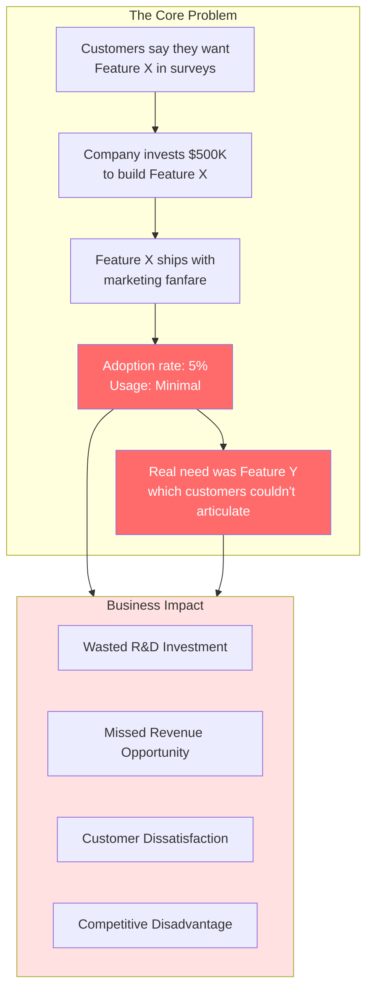

### 1.2 Market Pain Points

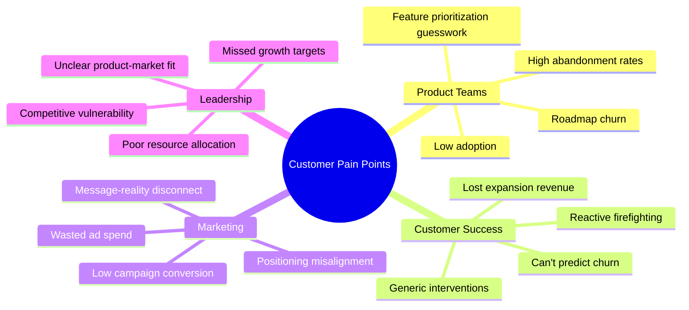

### 1.3 Current State Gaps

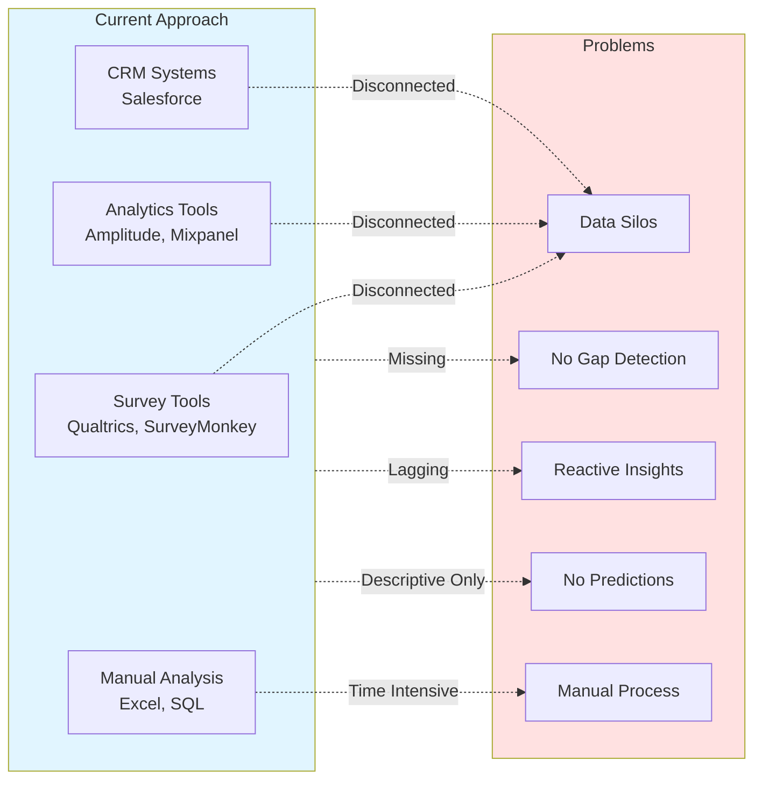

---

## 2. The Solution

### 2.1 Value Proposition

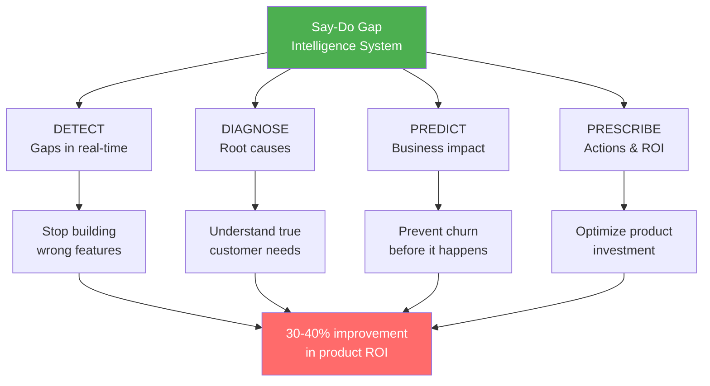

### 2.2 Competitive Differentiation

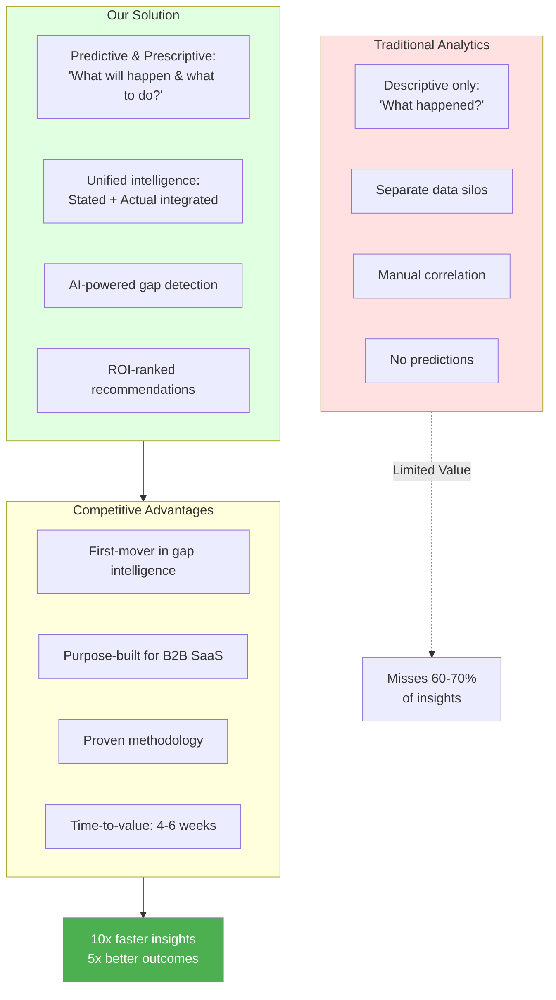

---

## 3. Market Opportunity

### 3.1 Total Addressable Market (TAM)

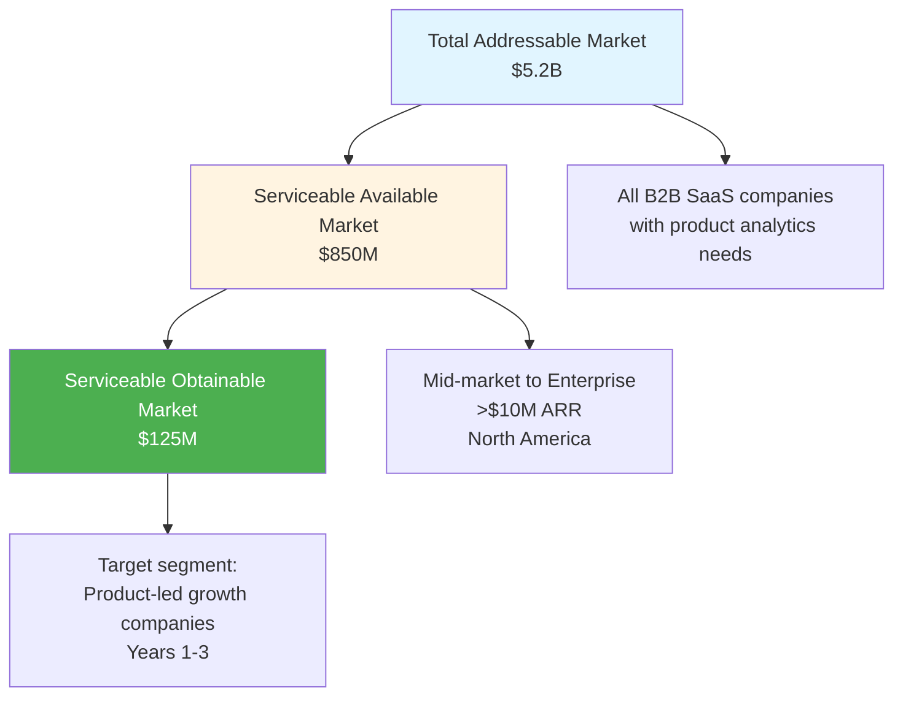

### 3.2 Target Customer Profile

```mermaid
graph LR
    subgraph ICP["Ideal Customer Profile"]
        I1[B2B SaaS]
        I2[$10M-$500M ARR]
        I3[Product-led growth]
        I4[50-500 employees]
        I5[High feature velocity]
    end
    
    subgraph Champions["Buyer Personas"]
        C1[VP Product<br/>Budget owner]
        C2[Head of Customer Success<br/>Economic buyer]
        C3[Chief Data Officer<br/>Technical buyer]
    end
    
    subgraph Pain["Key Pain Points"]
        P1[30-40% feature waste]
        P2[Unpredictable churn]
        P3[Low expansion rate]
        P4[Poor product-market fit signals]
    end
    
    ICP --> Champions
    Champions --> Pain
    Pain --> Value[Annual Value:<br/>$50K-$200K]
    
    style ICP fill:#e1f5ff
    style Champions fill:#fff4e1
    style Pain fill:#ffe1e1
    style Value fill:#4caf50,color:#fff
```

### 3.3 Go-to-Market Strategy

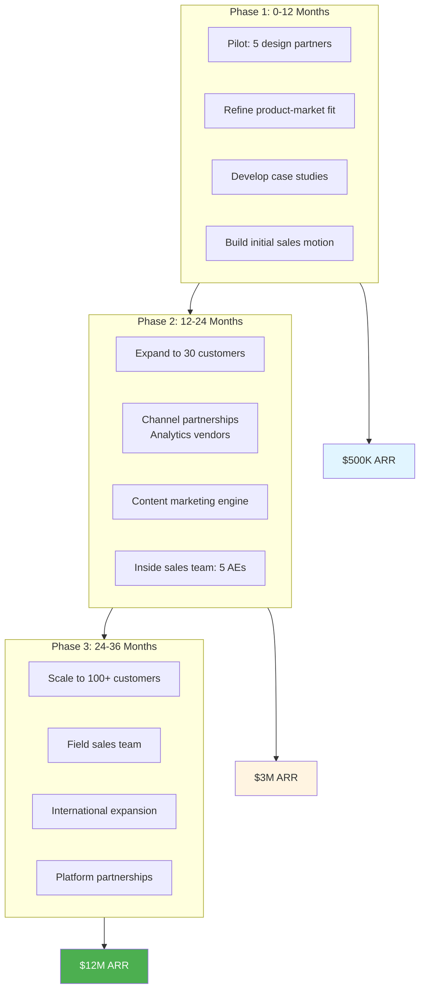

---

## 4. Business Model

### 4.1 Pricing Strategy

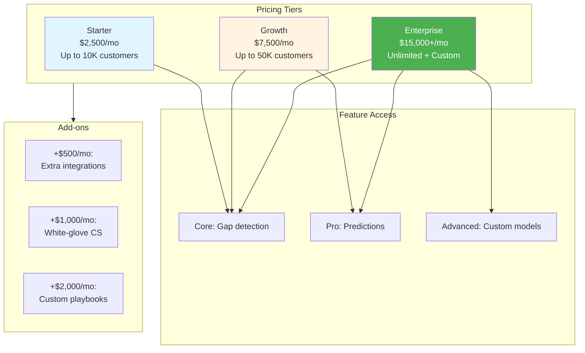

### 4.2 Revenue Model

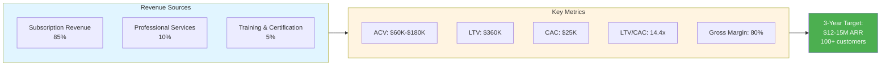

### 4.3 Unit Economics

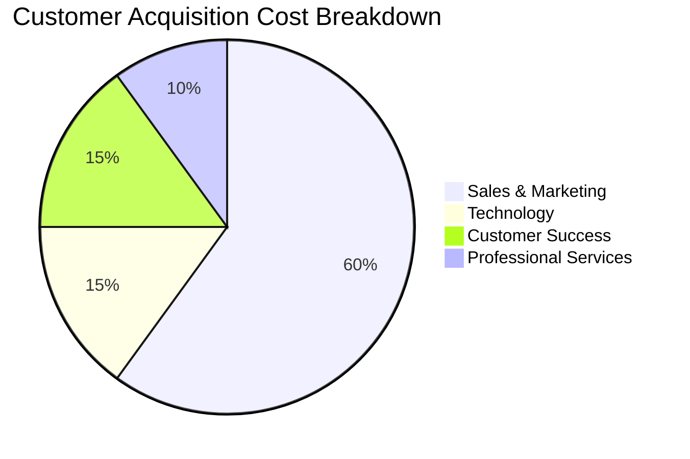

**Key Metrics:**
- **Average Contract Value (ACV):** $90K
- **Customer Acquisition Cost (CAC):** $25K
- **CAC Payback Period:** 4 months
- **Lifetime Value (LTV):** $360K (4-year retention)
- **LTV/CAC Ratio:** 14.4x
- **Gross Margin:** 80%
- **Net Revenue Retention:** 120%

---

## 5. Financial Projections

### 5.1 Revenue Forecast

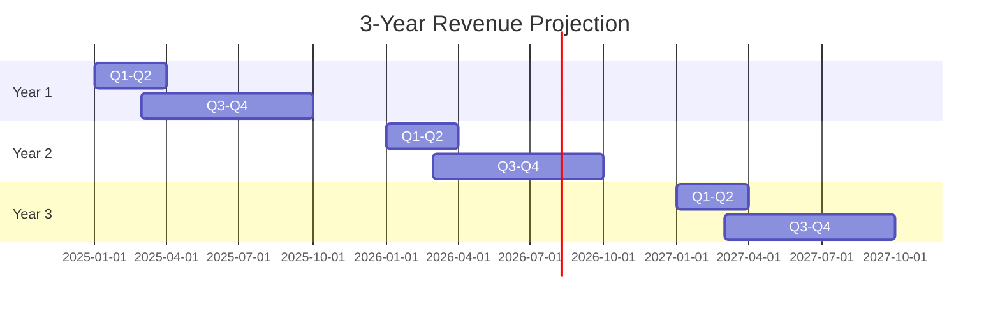

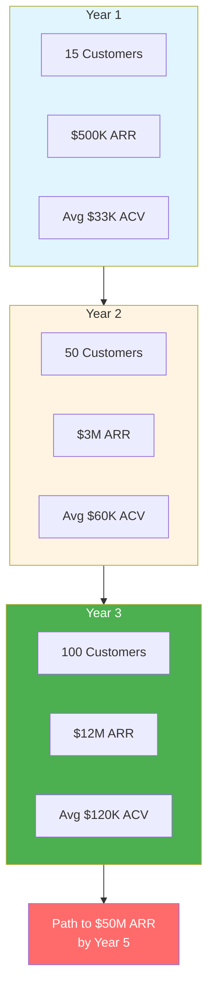

### 5.2 Investment Requirements

```mermaid
graph LR
    subgraph Seed["Seed Round: $2M"]
        S1[Product Development<br/>$800K]
        S2[Go-to-Market<br/>$600K]
        S3[Team: 8 people<br/>$500K]
        S4[Operations<br/>$100K]
    end
    
    subgraph Series_A["Series A: $8M (Month 18)"]
        A1[Sales & Marketing<br/>$3.5M]
        A2[Product & Engineering<br/>$2.5M]
        A3[Customer Success<br/>$1.5M]
        A4[Operations<br/>$500K]
    end
    
    Seed --> Traction[Prove product-market fit<br/>15 customers, $500K ARR]
    Traction --> Series_A
    Series_A --> Scale[Scale to 100+ customers<br/>$12M ARR]
    
    style Seed fill:#e1f5ff
    style Series_A fill:#fff4e1
    style Scale fill:#4caf50,color:#fff
```

### 5.3 Profitability Timeline

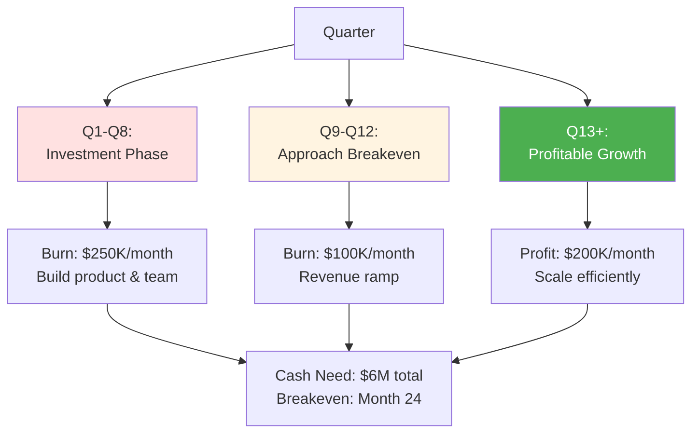

---

## 6. Customer Value & ROI

### 6.1 Customer ROI Model

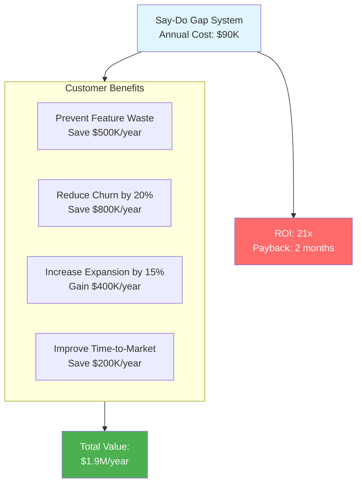

### 6.2 Case Study Example

```mermaid
graph LR
    subgraph Before["Before (Customer: Series B SaaS)"]
        B1[40% features unused]
        B2[12% annual churn]
        B3[Reactive CS approach]
        B4[3-month feature dev cycle]
    end
    
    subgraph After["After (6 months with system)"]
        A1[15% features unused<br/>↓ 62% improvement]
        A2[9.5% annual churn<br/>↓ 21% reduction]
        A3[Proactive interventions<br/>2x expansion rate]
        A4[6-week feature validation<br/>↓ 50% faster]
    end
    
    subgraph Impact["Business Impact"]
        I1[$1.2M saved<br/>Product efficiency]
        I2[$600K saved<br/>Retention]
        I3[$400K gained<br/>Expansion]
        I4[20% faster<br/>Innovation]
    end
    
    Before --> After --> Impact
    
    style Before fill:#ffe1e1
    style After fill:#e1ffe1
    style Impact fill:#4caf50,color:#fff
```

### 6.3 Value Delivery Timeline

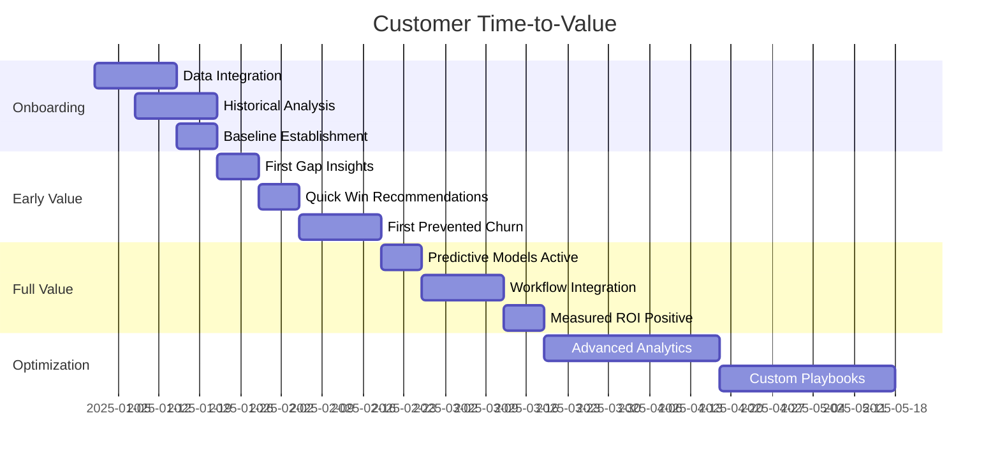

**Key Milestones:**
- **Week 2:** First gap insights delivered
- **Week 4:** First quick-win implemented
- **Week 8:** First prevented churn
- **Week 12:** Measured ROI positive
- **Month 6:** Full system optimization

---

## 7. Competitive Landscape

### 7.1 Competitive Positioning

```mermaid
quadrantChart
    title Competitive Positioning Matrix
    x-axis Low Predictive Power --> High Predictive Power
    y-axis Point Solution --> Platform
    quadrant-1 Leaders (Our Target)
    quadrant-2 Laggards
    quadrant-3 Niche Players
    quadrant-4 Incumbents
    Survey Tools: [0.2, 0.3]
    Analytics Platforms: [0.5, 0.8]
    Customer Success Tools: [0.4, 0.6]
    Us (Say-Do Gap): [0.9, 0.7]
    BI Tools: [0.3, 0.7]
```

### 7.2 Competitive Advantages

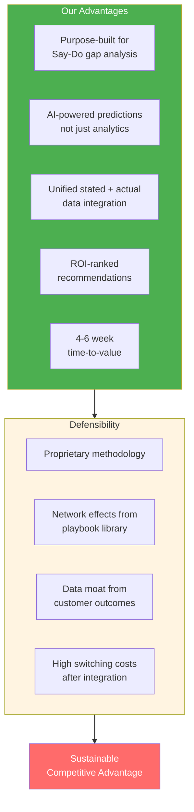

---

## 8. Growth Strategy

### 8.1 Customer Acquisition Channels

```mermaid
graph TB
    subgraph Content["Content Marketing (40%)"]
        C1[SEO-optimized blog]
        C2[Gap analysis templates]
        C3[Research reports]
        C4[Webinars]
    end
    
    subgraph Partnerships["Partnerships (30%)"]
        P1[Analytics platforms]
        P2[CRM integrations]
        P3[Consulting firms]
    end
    
    subgraph Direct["Direct Sales (20%)"]
        D1[Outbound SDRs]
        D2[Account-based marketing]
        D3[Executive events]
    end
    
    subgraph Community["Community (10%)"]
        CM1[Product leaders forum]
        CM2[Case studies]
        CM3[Referrals]
    end
    
    Content --> Leads[Qualified Leads]
    Partnerships --> Leads
    Direct --> Leads
    Community --> Leads
    
    Leads --> Sales[Sales Process]
    
    style Content fill:#e1f5ff
    style Partnerships fill:#fff4e1
    style Direct fill:#e1ffe1
    style Community fill:#ffe1f5
```

### 8.2 Expansion Strategy

```mermaid
graph LR
    Land[LAND<br/>Starter Tier<br/>$30K ACV] --> Adopt[ADOPT<br/>Prove Value<br/>3-6 months]
    
    Adopt --> Expand[EXPAND<br/>Growth Tier<br/>$90K ACV]
    
    Expand --> Advanced[ADVANCED<br/>Enterprise Tier<br/>$180K ACV]
    
    Advanced --> Multi[MULTI-PRODUCT<br/>Add-ons<br/>$200K+ ACV]
    
    subgraph Triggers["Expansion Triggers"]
        T1[Customer count growth]
        T2[Team expansion]
        T3[Advanced analytics needs]
        T4[Multi-department adoption]
    end
    
    Triggers -.-> Expand
    Triggers -.-> Advanced
    
    style Land fill:#e1f5ff
    style Expand fill:#fff4e1
    style Advanced fill:#e1ffe1
    style Multi fill:#4caf50,color:#fff
```

---

## 9. Risk Analysis

### 9.1 Key Risks & Mitigation

```mermaid
graph TB
    subgraph Risks["Key Risks"]
        R1[Market Risk:<br/>Slow adoption]
        R2[Technical Risk:<br/>Integration complexity]
        R3[Competition Risk:<br/>Incumbents respond]
        R4[Data Risk:<br/>Quality issues]
    end
    
    subgraph Mitigation["Mitigation Strategies"]
        M1[Pilot program proves ROI<br/>Focus on early adopters]
        M2[Pre-built connectors<br/>Professional services]
        M3[First-mover advantage<br/>IP protection]
        M4[Data quality framework<br/>Customer education]
    end
    
    R1 --> M1
    R2 --> M2
    R3 --> M3
    R4 --> M4
    
    Mitigation --> Managed[Managed Risk Profile]
    
    style Risks fill:#ffe1e1
    style Mitigation fill:#e1ffe1
    style Managed fill:#4caf50,color:#fff
```

---

## 10. Team & Execution

### 10.1 Founding Team Needs

```mermaid
graph TB
    subgraph Core["Core Team (Year 1)"]
        CEO[CEO/Co-founder<br/>Product visionary<br/>SaaS experience]
        CTO[CTO/Co-founder<br/>ML/Data expertise<br/>Platform architecture]
        VP_Sales[VP Sales<br/>Enterprise B2B<br/>Analytics space]
        Eng1[Senior Engineer<br/>Full-stack]
        Eng2[ML Engineer<br/>MLOps]
        CS[Customer Success Lead<br/>SaaS onboarding]
        PM[Product Manager<br/>Analytics products]
        Marketing[Marketing Lead<br/>Content + Growth]
    end
    
    Core --> Advisors[Advisory Board<br/>SaaS CEOs<br/>Product leaders<br/>ML experts]
    
    style CEO fill:#ff6b6b,color:#fff
    style CTO fill:#ff6b6b,color:#fff
    style VP_Sales fill:#4caf50,color:#fff
```

### 10.2 Organizational Roadmap

```mermaid
gantt
    title Team Growth Plan
    dateFormat  YYYY-MM
    section Year 1 (8 people)
    Core founding team                :2025-01, 12M
    
    section Year 2 (25 people)
    Sales: 5 AEs + 3 SDRs             :2026-01, 12M
    Engineering: +4                    :2026-01, 12M
    CS: +3                            :2026-01, 12M
    Marketing: +2                      :2026-01, 12M
    
    section Year 3 (50 people)
    Sales: +10                        :2027-01, 12M
    Engineering: +8                   :2027-01, 12M
    CS: +5                           :2027-01, 12M
    Marketing: +3                     :2027-01, 12M
    Operations: +4                    :2027-01, 12M
```

---

## 11. Investment Ask

### 11.1 Funding Requirements

```mermaid
graph TB
    Ask[Seed Round: $2M] --> Use1[Product: $800K<br/>MVP to market-ready]
    Ask --> Use2[GTM: $600K<br/>Sales & marketing launch]
    Ask --> Use3[Team: $500K<br/>8-person core team]
    Ask --> Use4[Operations: $100K<br/>Infrastructure & legal]
    
    subgraph Milestones["18-Month Milestones"]
        M1[Product GA launch]
        M2[15 paying customers]
        M3[$500K ARR]
        M4[Validated product-market fit]
    end
    
    Use1 & Use2 & Use3 & Use4 --> Milestones
    
    Milestones --> Series_A[Series A Position:<br/>$8M at $40M valuation]
    
    style Ask fill:#ff6b6b,color:#fff
    style Milestones fill:#4caf50,color:#fff
    style Series_A fill:#e1f5ff
```

### 11.2 Use of Funds

```mermaid
pie title Seed Fund Allocation ($2M)
    "Product Development" : 40
    "Sales & Marketing" : 30
    "Team Compensation" : 25
    "Operations & Infrastructure" : 5
```

### 11.3 Return Potential

```mermaid
graph LR
    Investment[Seed Investment<br/>$2M @ $8M pre] --> Own[Ownership: 20%]
    
    Own --> Y3[Year 3<br/>$12M ARR<br/>$60M valuation]
    
    Y3 --> Y5[Year 5<br/>$50M ARR<br/>$300M valuation]
    
    Y5 --> Exit1[Exit Scenario 1:<br/>Acquisition<br/>$400M]
    Y5 --> Exit2[Exit Scenario 2:<br/>IPO<br/>$600M+]
    
    Exit1 --> Return1[20x return<br/>$40M]
    Exit2 --> Return2[30x+ return<br/>$60M+]
    
    style Investment fill:#e1f5ff
    style Exit1 fill:#4caf50,color:#fff
    style Exit2 fill:#ff6b6b,color:#fff
    style Return1 fill:#4caf50,color:#fff
    style Return2 fill:#ff6b6b,color:#fff
```

---

## 12. Pitch Deck Outline

### Slide Structure (15 slides)

```mermaid
graph TB
    S1[1. Cover<br/>Company name, tagline, contact]
    S2[2. Problem<br/>The Say-Do gap crisis]
    S3[3. Market Size<br/>$5.2B TAM, $850M SAM]
    S4[4. Solution<br/>AI-powered gap intelligence]
    S5[5. Product Demo<br/>Live dashboard walkthrough]
    S6[6. Business Model<br/>$60K-$180K ACV, SaaS]
    S7[7. Traction<br/>5 design partners, early results]
    S8[8. Go-to-Market<br/>Channels & strategy]
    S9[9. Competition<br/>Positioning map]
    S10[10. Competitive Advantage<br/>Moats & differentiation]
    S11[11. Team<br/>Founders & advisors]
    S12[12. Financials<br/>3-year projections]
    S13[13. Roadmap<br/>Product & milestones]
    S14[14. The Ask<br/>$2M seed round]
    S15[15. Vision<br/>Transform product intelligence]
    
    S1 --> S2 --> S3 --> S4 --> S5 --> S6 --> S7 --> S8 --> S9 --> S10 --> S11 --> S12 --> S13 --> S14 --> S15
    
    style S1 fill:#e1f5ff
    style S4 fill:#4caf50,color:#fff
    style S14 fill:#ff6b6b,color:#fff
```

---

## Appendix: Supporting Materials

### A1. Sample Customer Testimonial Template

> "Before [Product Name], we were flying blind on feature prioritization. We spent $2M building features customers said they wanted, only to see 40% go unused. Within 6 months of deploying the Say-Do Gap Intelligence System, we:
> 
> - Reduced wasted R&D by 60%
> - Decreased churn by 21% through early intervention
> - Increased expansion revenue by 35%
> - Cut feature development cycles in half
> 
> The ROI was undeniable within 90 days. This is now the foundation of our product strategy."
> 
> — VP of Product, Series B SaaS Company ($50M ARR)

### A2. Key Performance Indicators (KPIs)

```mermaid
graph TB
    subgraph Product["Product Metrics"]
        PM1[Weekly Active Users]
        PM2[Gaps Detected/Customer]
        PM3[Prediction Accuracy]
        PM4[Time-to-First-Insight]
    end
    
    subgraph Business["Business Metrics"]
        BM1[MRR Growth Rate]
        BM2[Logo Retention]
        BM3[Net Revenue Retention]
        BM4[CAC Payback Period]
    end
    
    subgraph Customer["Customer Success"]
        CM1[Customer ROI Realized]
        CM2[NPS Score]
        CM3[Feature Adoption]
        CM4[Support Ticket Volume]
    end
    
    Product --> Health[Business Health]
    Business --> Health
    Customer --> Health
    
    style Health fill:#4caf50,color:#fff
```

### A3. Exit Strategy Options

```mermaid
graph TB
    Company[Say-Do Gap Intelligence] --> Option1[Strategic Acquisition]
    Company --> Option2[IPO]
    Company --> Option3[Continue Growing]
    
    Option1 --> Buyers
    subgraph Buyers["Potential Acquirers"]
        B1[Analytics Platforms<br/>Amplitude, Mixpanel]
        B2[CRM Giants<br/>Salesforce, HubSpot]
        B3[Enterprise Software<br/>Adobe, Microsoft]
        B4[Private Equity]
    end
    
    Option2 --> IPO_Path[IPO Path:<br/>$100M+ ARR<br/>Year 7-8]
    
    Option3 --> Build[Build to $500M+ ARR<br/>Market leader]
    
    style Option1 fill:#e1f5ff
    style Option2 fill:#fff4e1
    style Option3 fill:#e1ffe1
```

---

## Contact Information

**For Investment Inquiries:**
- Email: invest@saydogap.ai
- Website: www.saydogap.ai
- Deck: [Link to full pitch deck]

**Follow-up Materials Available:**
- Detailed financial model
- Product roadmap
- Technical architecture deep-dive
- Customer case studies
- Market research report
